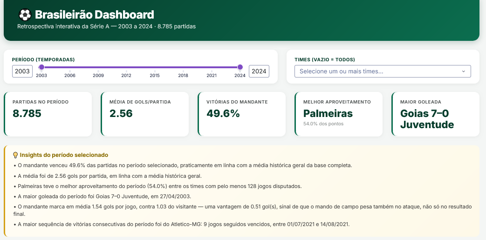
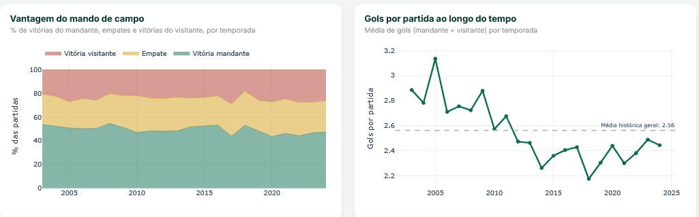
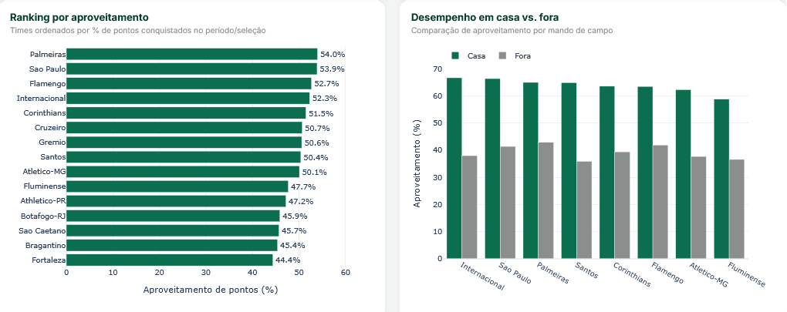
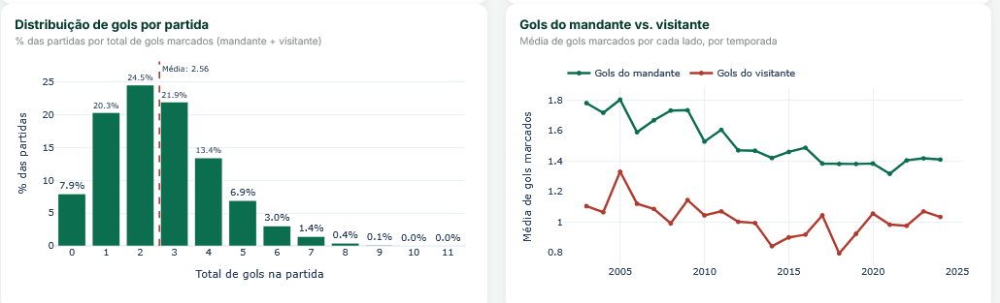
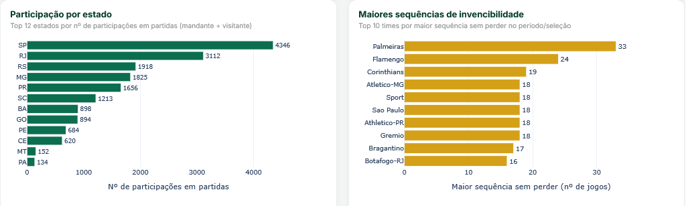

# EDA — Campeonato Brasileiro Série A (2003–2024)

Análise exploratória de 21 anos e 8.785 partidas do Brasileirão, orientada a perguntas de negócio (não só descrição estatística). Projeto de portfólio focado em storytelling analítico: cada seção parte de uma pergunta, testa uma hipótese nos dados e termina em um insight acionável.

https://brasileirao-eda-dash.onrender.com - Dashboard Online








## Perguntas respondidas

1. O mando de campo ainda é uma vantagem real, ou está diminuindo com o tempo?
2. O futebol brasileiro está ficando mais defensivo (menos gols) ao longo dos anos?
3. Quais clubes dominam historicamente a Série A?
4. Existem clubes com "fator casa" muito acima da média?
5. Como o poder do futebol brasileiro se distribui entre os estados?
6. Quais técnicos têm o melhor aproveitamento histórico (min. 100 jogos)?

## Principais insights

- A vantagem do mandante caiu de ~50-54% de vitórias (anos 2000) para ~44-48% (última década), com o ano de 2020 (sem torcida, pandemia) reforçando que parte do "fator casa" vem do público, não só da logística.
- Não há tendência estrutural de queda nos gols por partida — a média histórica (~2,55 gols/jogo) se mantém estável; a nostalgia de "tinha mais gol antes" não se sustenta nos dados.
- O poder do campeonato é concentrado: poucos clubes tradicionais dominam tanto aproveitamento quanto volume de jogos disputados (viés de permanência na Série A).
- Alguns clubes têm um gap de desempenho casa vs. fora muito acima da média — relevante para qualquer modelo preditivo que trate "mando" como efeito fixo igual pra todos os times.
- O eixo SP-RJ-MG-RS-PR concentra a maior parte das participações históricas na Série A.

## Dados

Fonte: [adaoduque/Brasileirao_Dataset](https://github.com/adaoduque/Brasileirao_Dataset) (GitHub, domínio público), partidas de 2003 a 2024.

**Limitações declaradas:** as colunas de técnico e formação só têm cobertura confiável a partir de ~2015; o dataset não inclui orçamento, elenco ou público pagante, variáveis relevantes para qualquer análise causal mais profunda.

## Estrutura do projeto

```
brasileirao-eda/
├── data/
│   └── campeonato-brasileiro-full.csv
├── images/
│   └── *.png              (gráficos exportados)
├── brasileirao_eda.ipynb  (notebook completo, já executado)
├── requirements.txt
└── README.md
```

## Como rodar

```bash
pip install -r requirements.txt
jupyter notebook brasileirao_eda.ipynb
```

## Stack

Python · pandas · matplotlib · seaborn · Jupyter

---
*Projeto de portfólio — parte da preparação para vaga de estágio em Dados.*
